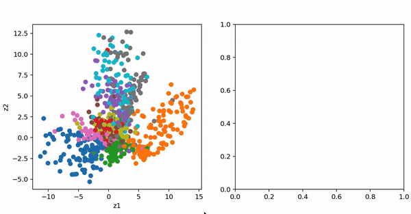

# Short Introduction to Machine Learning

This repository contains a short introduction I gave to PhD student (astrophysics) at UCSC.

The notebooks require `tensorflow >= 2.0`, `Tensoflow Datasets`, `tensorflow probability` and classic scientific libs such as `numpy` or `matplotlib`.

While you can read and follow the notebooks alone, they were created in the context of presenting them _on site_, and are thought in this way, not as a pure stand-alone introduction.

You can find the slides presenting a brief and general introduction to Machine and Deep learning in `General_Intro_M.key`

The slide introduction was followed by 4 increasing complexity notebooks:

- `Linear_Regression.ipynb` shows the very basic of ML with a simple (and stupid) example of predicting a linear regression with a single neuron.

- `Polynomial_fit.ipynb` increase a bit the complexity of the model by stacking neurons vertically and horizontally to form a first deep network (Fully connected), predicting a polynomial fit (yeah, you should not use deep learning for that...)

- `Exploring_AE.ipynb` goes much more deeply in complexity, in order to show --still in an understandable way -- what cool stuff you can do with simple models. We use an AutoEncoder to generate new handwritten digits, and explore the latent distribution found by the encoder:

- `VAE_mnist.ipynb` go one step further, introducing Variational AutoEncoders and the problematic of the _curse of dimension_.

Additionally, there is a short tutorial introducing how to use the tenosrlfow dataset API in `tf2_dataset_tuto.ipynb`